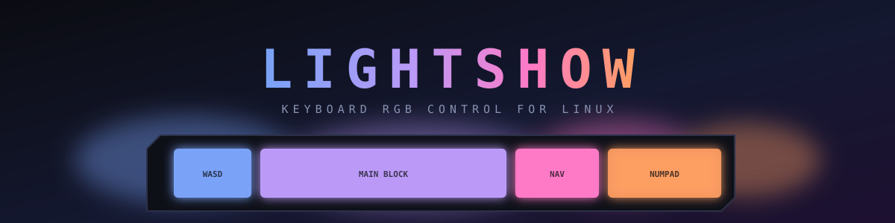
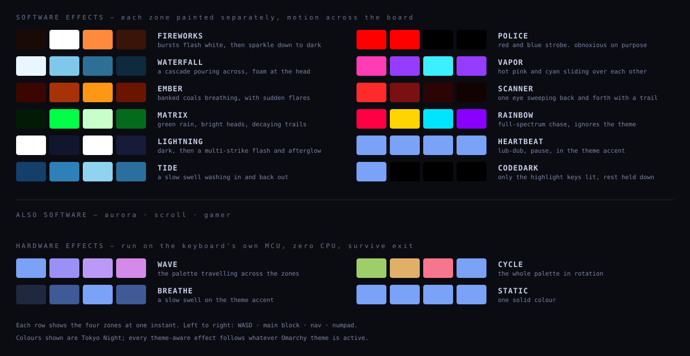
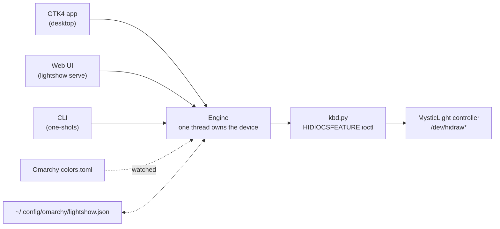

<div align="center">



**Keyboard RGB control for MSI laptops on Linux, with a real desktop app.**
20 effects · live theme matching · day/night profiles · no vendor software, no Windows, no VM.

[](#requirements)
[](#requirements)
[](#requirements)
[](#requirements)
[](LICENSE)

</div>

---

## Does this work on my machine?

**Read this part first.** This drives one specific family of hardware.

LightShow talks to **MSI "MysticLight" keyboard LED controllers** over raw USB HID.
It is *not* a general RGB tool. It will not drive Razer, Corsair, Logitech, ASUS,
Framework, or desktop motherboard lighting.

Check in one command:

```bash
grep -l MysticLight /sys/class/hidraw/*/device/uevent 2>/dev/null && echo "supported controller found"
```

| Device | Model | Status |
|---|---|---|
| `0db0:1801` | MSI Crosshair 16 Max HX (MS-1801) | ✅ **Verified** — developed and tested on this |
| `0db0:1606` | MSI Cyborg 15 (MS-1606) | 🟡 Reported — same packet format, untested here |
| `0db0:1605` | MSI Vector A18 HX (MS-1605) | 🟡 Reported — untested here |
| `1462:1601` | MSI Katana 15 HX (MS-1565) | 🟡 Reported — untested here |
| `1462:1562/3/4` | MSI Delta 15, Alpha 15/17 | 🟡 Reported — untested here |
| anything else reporting `MysticLight` | unlisted MSI laptops | 🔵 Auto-detected, worth trying |

Detection matches the HID **product string**, not a hardcoded product ID, so models
nobody has catalogued are picked up automatically. If yours reports a different
name, point straight at it:

```bash
LIGHTSHOW_DEVICE=/dev/hidraw3 lightshow
```

> **Why not OpenRGB?** OpenRGB has no entry for these product IDs and detects
> zero devices on the hardware this was built for. The protocol here is ported
> from OpenRGB's `MSIKeyboard1565Controller` and verified packet by packet
> against real hardware. See [docs/PROTOCOL.md](docs/PROTOCOL.md).

---

## Effects



Two families, and the difference is worth understanding:

**Hardware effects** hand the controller a set of keyframes and let its own
microcontroller interpolate between them forever. They cost **zero CPU**, and
they keep running after you close the app. The trade-off is that one animation
applies to every zone in lockstep.

**Software effects** paint each zone separately on every frame. That is the only
way to get motion *across* the keyboard, but it needs a live process and stops
when the app stops.

---

## The zone model, honestly

MSI markets these keyboards as "24-zone RGB". The **command interface exposes
four zone groups**, and there is no per-key addressing in this protocol.

```
┌──────────┬─────────────────────────┬──────────┬────────────┐
│  WASD    │      MAIN BLOCK         │   NAV    │   NUMPAD   │
│  mask 1  │        mask 2           │  mask 4  │   mask 8   │
└──────────┴─────────────────────────┴──────────┴────────────┘
```

On the verified hardware, the WASD group covers the gaming highlight set:
Left Shift, SUPER, Q, W, R, F, the arrows and the number row. That is what the
`codedark` effect lights.

**Known hardware limits** (tested, not assumed):

- Lighting *any* zone raises a dim base backlight across the whole board.
  Static black, per-zone `MODE_OFF`, both write orders and the unused zone
  bitmask bits were all tried; none reduce it. Only a whole-board off reaches
  true black.
- There is no brightness field in the protocol. Brightness is applied by
  scaling RGB values before sending them.
- Scrolling text is one travelling pulse per letter. Four cells cannot draw
  letter shapes, so you see the word's rhythm crossing the board, not glyphs.

---

## Install

```bash
git clone https://github.com/nixfred/lightshow.git
cd lightshow
./install.sh
```

The installer adds a launcher to `~/.local/bin`, a desktop entry and icon, and a
udev rule. It checks for GTK4 and tells you what it finds rather than failing
silently. `./install.sh --uninstall` reverses all of it.

### The udev rule

The LED controller is at `/dev/hidraw*`, root-only by default. The rule grants
the `wheel` group access to MSI controllers only:

```
KERNEL=="hidraw*", ATTRS{idVendor}=="0db0", MODE="0660", GROUP="wheel"
KERNEL=="hidraw*", ATTRS{idVendor}=="1462", MODE="0660", GROUP="wheel"
```

`wheel` rather than `input` because a wheel member already has sudo, so this
grants nothing that was not already available, and it needs no re-login. **That
hidraw node is the LED microcontroller, not the key input device**, so write
access to it cannot be used to read keystrokes. Skip it with
`./install.sh --no-udev` and run with sudo instead.

---

## Requirements

| | |
|---|---|
| OS | Linux with `hidraw` (any modern kernel) |
| Python | 3.9+ — **standard library only**, nothing to pip install |
| Desktop app | GTK4 + libadwaita via PyGObject |
| Web UI | nothing extra |

On Arch: `sudo pacman -S python-gobject gtk4 libadwaita`

Without GTK4 the desktop app will not start, but `lightshow serve` and every
command-line form still work.

---

## Usage

```bash
lightshow                      # the desktop app
lightshow serve                # web UI on 127.0.0.1:8787 instead
lightshow list                 # every effect
lightshow status               # what hardware and theme were detected

lightshow wave                 # apply a hardware effect and exit
lightshow off
lightshow day                  # load the day profile
lightshow fav "Bonfire"        # load a saved favourite
```

Hardware effects applied from the command line keep running after the process
exits. Software effects need the app open, because something has to step the
animation.

---

## Theme matching

LightShow reads the active [Omarchy](https://omarchy.org) theme's `colors.toml`
and uses its palette. Switch themes and the keyboard follows within a few
seconds — the engine re-resolves the palette and re-applies on its own, so it
works no matter how the theme changed, including a hand-edited file.

Dark background colours are filtered out deliberately: on a keyboard they read
as "off" and make an animation look broken rather than subtle.

Not on Omarchy? Turn off **Match theme** and pick your own colours. Everything
else works the same.

---

## Architecture



Only one process may drive the controller at a time, so every front end routes
through a single engine that stops the running effect before starting the next.
The front ends are interchangeable; the protocol, effects and persistence never
change.

---

## Configuration

Everything persists to `~/.config/omarchy/lightshow.json`: the current look,
named favourites, the day and night profiles, and the auto-switch schedule.
Written atomically, so an interrupted write never leaves a half-valid file.

---

## Credits

The packet format is ported from
[OpenRGB](https://gitlab.com/CalcProgrammer1/OpenRGB)'s
`MSIKeyboard1565Controller`, which did the original reverse engineering of this
protocol family. LightShow adds the newer product IDs, the effects, the theme
integration and the front ends.

## License

MIT — see [LICENSE](LICENSE).
