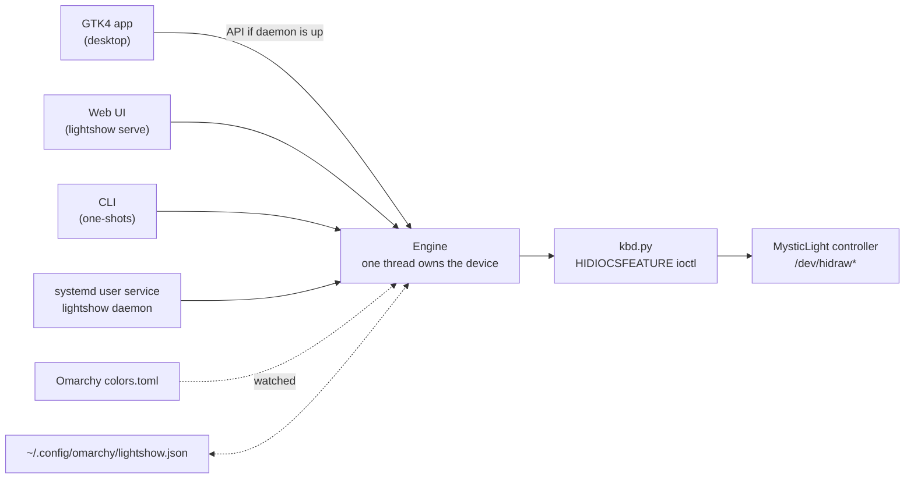

<div align="center">


**Keyboard RGB control for MSI laptops and the Turtle Beach KB7 on Linux, with a real desktop app.**
21 effects · always in your Omarchy theme's colours · no vendor software, no Windows, no VM.

[](#requirements)
[](#requirements)
[](#requirements)
[](#requirements)
[](LICENSE)

</div>

---

## Does this work on my machine?

**Read this part first.**

LightShow has native drivers for **MSI "MysticLight" keyboard LED controllers**
and the **Turtle Beach Command Series KB7** (raw USB HID, verified packet by
packet), and beyond those it drives **any keyboard backlight the Linux kernel
exposes** (white or RGB, see [Any keyboard that lights up](#any-keyboard-that-lights-up))
and **QMK keyboards with VIA**. Every board reports what it can do and the
window says, per keyboard, what it cannot.

Check in one command:

```bash
grep -lE 'MysticLight|10F5:00005038' /sys/class/hidraw/*/device/uevent 2>/dev/null && echo "supported keyboard found"
```

If both are plugged in, LightShow drives both at once.

| Device | Model | Status |
|---|---|---|
| `0db0:1801` | MSI Crosshair 16 Max HX (MS-1801) | ✅ **Verified** — developed and tested on this |
| `0db0:1606` | MSI Cyborg 15 (MS-1606) | 🟡 Reported — same packet format, untested here |
| `0db0:1605` | MSI Vector A18 HX (MS-1605) | 🟡 Reported — untested here |
| `1462:1601` | MSI Katana 15 HX (MS-1565) | 🟡 Reported — untested here |
| `1462:1562/3/4` | MSI Delta 15, Alpha 15/17 | 🟡 Reported — untested here |
| anything else reporting `MysticLight` | unlisted MSI laptops | 🔵 Auto-detected, worth trying |
| `10f5:5038` | Turtle Beach Command Series KB7 (firmware 1.22 and 1.37) | ✅ **Verified** — per-key backlight, see [below](#turtle-beach-kb7) |

Detection matches the HID **product string**, not a hardcoded product ID, so models
nobody has catalogued are picked up automatically. If yours reports a different
name, point straight at it:

```bash
LIGHTSHOW_DEVICE=/dev/hidraw3 lightshow
```

> **Why native drivers for these two?** OpenRGB has no entry for their product
> IDs and detects zero devices on the hardware this was built for. The MSI
> protocol here is ported from OpenRGB's `MSIKeyboard1565Controller` and both
> drivers are verified packet by packet against real hardware. For every
> keyboard OpenRGB *does* know, LightShow uses OpenRGB, see
> [Any keyboard that lights up](#any-keyboard-that-lights-up). Details in
> [docs/PROTOCOL.md](docs/PROTOCOL.md).

---

## Effects


The default is **breathe**: each zone breathes through the theme's colours, in
on one, out to near dark, in on the next. It runs on the keyboards' own
microcontrollers, so it costs nothing and survives the app closing. **Smatter**
is the busiest of the software effects: all four zones wearing a different
theme colour at once, each walking the palette at a deliberately non-harmonic
rate so the combination never settles into a repeating pattern.

Two families, and the difference is worth understanding:

**Hardware effects** hand the controller a set of keyframes and let its own
microcontroller interpolate between them forever. They cost **zero CPU**, and
they keep running after you close the app. The trade-off is that one animation
applies to every zone in lockstep.

**Software effects** paint each zone separately on every frame. That is the only
way to get motion *across* the keyboard, but it needs a live process and stops
when the app stops.

---

## The zone model, honestly

MSI markets these keyboards as "24-zone RGB". The **command interface exposes
four zone groups**, and there is no per-key addressing in this protocol.

```
┌──────────┬─────────────────────────┬──────────┬────────────┐
│  WASD    │      MAIN BLOCK         │   NAV    │   NUMPAD   │
│  mask 1  │        mask 2           │  mask 4  │   mask 8   │
└──────────┴─────────────────────────┴──────────┴────────────┘
```

On the verified hardware, the WASD group covers the gaming highlight set:
Left Shift, SUPER, Q, W, R, F, the arrows and the number row. That is what the
`codedark` effect lights.

**Known hardware limits** (tested, not assumed):

- Lighting *any* zone raises a dim base backlight across the whole board.
  Static black, per-zone `MODE_OFF`, both write orders and the unused zone
  bitmask bits were all tried; none reduce it. Only a whole-board off reaches
  true black.
- There is no brightness field in the protocol. Brightness is applied by
  scaling RGB values before sending them.
- Scrolling text is one travelling pulse per letter. Four cells cannot draw
  letter shapes, so you see the word's rhythm crossing the board, not glyphs.

---

## Turtle Beach KB7

The KB7 is a different kind of device. It has **101 individually lit keys**, and
its whole backlight lives in one **persistent per-profile record** (HID feature
report `0x11`, 348 bytes, on USB interface 2). LightShow maps its four zones onto
KB7 key groups:

| LightShow zone | KB7 keys |
|---|---|
| WASD (mask 1) | W A S D |
| Main block (mask 2) | letters, numbers, F-row, modifiers, Space |
| Nav (mask 4) | the arrow cluster and the keys beside it |
| Numpad (mask 8) | the 37-LED light bar along the front edge and the media row (the KB7 has no numpad) |

What it does, and what it deliberately does not:

- **Static, breathe and wave** run on the keyboard's own microcontroller. LightShow
  writes one record when you apply the look and nothing after that. Wave is the
  mode the board ships running, in your theme colours. Cycle has no firmware
  equivalent on the KB7 and shows as the wave.
- **Software effects animate live** (firmware 1.37). LightShow switches the KB7 into
  direct mode, waits until it reports ready, and streams frames on USB interface 1
  at up to 20 fps. Frames never touch the persistent record, so there is no flash
  wear. Picking a static look, or stopping LightShow, switches direct mode off.
- **Before streaming starts**, the effect's colours are saved once as a still look,
  so the keys still show something sensible if the stream stops.
- **Direct mode and typing:** on firmware 1.22, direct mode made a key resting under
  a finger repeat. It is only on while a software effect runs; pick a static look if
  you ever see repeats.
- **Only the active profile** is written, using the board's own record as the
  template, so speed, brightness and unused LED slots stay exactly as they were.
- **Requests are paced.** On firmware 1.22 a read that follows a write within a few
  milliseconds wedges the keyboard's report handler. LightShow waits 300 ms after
  every write and backs off for 10 seconds after any failure; left alone the
  handler recovers in seconds.
- **Replug and it comes back.** The driver notices a new USB enumeration, leaves the
  fresh board alone for 10 seconds (a plug-time helper may be writing the tile
  labels on the same node), then reopens it and puts the current look back. No
  restart needed. Proven with a software replug (`authorized` 0/1 in sysfs):
  unplug seen, reopened 14 s later, look back on the keys one second after.
- **Sharing the board with another tool.** Two advisory lock files in
  `$XDG_RUNTIME_DIR` let a second program coexist: `kb7-control.lock` is held for
  one control-interface transaction at a time (a read; a write plus its 300 ms
  settle; a whole select-and-read), `kb7-iface1.lock` for one streamed frame or one
  screen-image upload. Take them the same way and the two never interleave.
- The screen, tile labels and firmware updates are out of scope.

The record layout was captured from Turtle Beach's Swarm II driving a KB7 on
firmware 1.22, and LightShow's writes were checked byte for byte against those
captures. The key-to-LED table comes from the same device support package.

---

## Any keyboard that lights up

Beyond the two native drivers, LightShow drives **whatever keyboard backlight
the Linux kernel exposes**, with no vendor software:

| Where the kernel puts it | What it is | What LightShow does with it |
|---|---|---|
| `/sys/class/leds/*::kbd_backlight` | a white backlight with a few levels (ThinkPad, Dell, ASUS, HP, Chromebook) | steady, breathe as a brightness pulse, off; animated effects show as light and dark |
| `/sys/class/leds/rgb:kbd_backlight*` | the multicolor class: one colour group, a few, or one entry per key (TUXEDO) | theme colours per group; animated effects streamed at 5 fps for a few groups, a still look for per-key trees |

Every board reports what it can do, read from the hardware, never guessed from
a name: colour (none, one, zones, per-key), brightness levels, whether it takes
streamed frames, and which effects its firmware runs itself. The window lists
each connected keyboard with **one line about what it cannot do**, for example
*"Keyboard backlight has no colour control: brightness, breathe and off only."*
An effect no connected keyboard can show at all is greyed out; one that a board
shows reduced says so in its tooltip. Nothing errors.

**Everything OpenRGB knows** (Razer, Corsair, Logitech, SteelSeries, ASUS,
HyperX, Roccat, and hundreds more): install the `openrgb` package and LightShow
uses it. The daemon starts OpenRGB's SDK server headless if none is running,
asks it for every device, keeps the keyboards, and drives each by what it
reports: a mode with per-LED colour ("Direct", which writes no flash) gets
streamed effects with LightShow's four zones spread over the keys; a board
with fixed firmware modes only gets the closest one (Static, Breathing,
Spectrum Cycle, Wave) with the theme's colours where the mode takes any; a
colourless board gets brightness. Nothing is ever saved to a device. A keyboard
a native driver already owns is skipped, so nothing is driven twice. If OpenRGB
has no keyboard to offer, its server is shut down again and not asked until
the next start. `LIGHTSHOW_OPENRGB=0` leaves the bridge out;
`LIGHTSHOW_OPENRGB_HOST`/`_PORT` point it at a server elsewhere.

**QMK keyboards with VIA** (Keychron and most custom boards) are found by the
raw-HID usage their firmware advertises (page `0xFF60`, usage `0x61`), no
vendor list needed, and driven through VIA's lighting channel: one colour for
the board in the theme's accent, brightness, off, breathe as a brightness pulse,
and animated effects as that one colour changing ten times a second. Nothing is
ever saved to the keyboard's EEPROM, so its own saved look returns when
LightShow stops. Firmware older than VIA protocol 12 (VIA v3, QMK 0.18) is
reported and left alone. The hidraw node must be writable: `lightshow status`
prints the one udev line to add for a keyboard it can see but not open.

Writing a sysfs backlight needs permission: `install.sh` adds a udev rule that
opens `*kbd_backlight*` LEDs to the `input` group (sysfs files cannot take the
per-seat ACL a hidraw node gets). Without it, brightness still works through
UPower's D-Bus interface; colour does not. A laptop whose RGB controller is
already driven natively and whose kernel LED is the same keys can leave the
kernel board out with `LIGHTSHOW_NO_LEDS=1`.

---

## Install

```bash
git clone https://github.com/nixfred/lightshow.git
cd lightshow
./install.sh
```

The installer adds a launcher to `~/.local/bin`, a desktop entry and icon, and a
udev rule. It checks for GTK4 and tells you what it finds rather than failing
silently. `./install.sh --uninstall` reverses all of it.

### The udev rule

The LED controller is at `/dev/hidraw*`, root-only by default. The rule grants
the `wheel` group access to MSI controllers only:

```
KERNEL=="hidraw*", ATTRS{idVendor}=="0db0", MODE="0660", GROUP="wheel"
KERNEL=="hidraw*", ATTRS{idVendor}=="1462", MODE="0660", GROUP="wheel"
```

`wheel` rather than `input` because a wheel member already has sudo, so this
grants nothing that was not already available, and it needs no re-login. **That
hidraw node is the LED microcontroller, not the key input device**, so write
access to it cannot be used to read keystrokes. Skip it with
`./install.sh --no-udev` and run with sudo instead.

For the KB7 a second rule opens **only the control interface** (USB interface 2),
for the logged-in seat. Interface 3 is the keyboard itself and is deliberately
not matched:

```
KERNEL=="hidraw*", ATTRS{idVendor}=="10f5", ATTRS{idProduct}=="5038", ATTRS{bInterfaceNumber}=="02", TAG+="uaccess"
```

---

## Requirements

| | |
|---|---|
| OS | Linux with `hidraw` (any modern kernel) |
| Python | 3.9+ — **standard library only**, nothing to pip install |
| Desktop app | GTK4 + libadwaita via PyGObject |
| Web UI | nothing extra |

On Arch: `sudo pacman -S python-gobject gtk4 libadwaita`

Without GTK4 the desktop app will not start, but `lightshow serve` and every
command-line form still work.

---

## Usage

```bash
lightshow                      # the desktop app
lightshow daemon               # engine only, no window (what the service runs)
lightshow serve                # web UI on 127.0.0.1:8787 instead
lightshow list                 # every effect
lightshow status               # what hardware and theme were detected

lightshow wave                 # apply a hardware effect and exit
lightshow off
```

Hardware effects applied from the command line keep running after the process
exits. Software effects need a live process, which is what the background
service is for.

### The background service

`install.sh` enables a systemd **user** service that runs `lightshow daemon` at
login, with restart-on-failure. Without it, software effects stop the moment you
close the window and the keyboard stops following your theme.

```bash
systemctl --user status lightshow      # is it running
systemctl --user restart lightshow
systemctl --user disable --now lightshow
```

Only one process may own the LED controller, so the desktop app **detects a
running daemon and drives it over the local API** instead of opening the device
itself. The window's status line says `daemon` or `local` so you can tell which
you have. No daemon, no problem: the app falls back to owning the device.

---

## Theme matching

LightShow reads the active [Omarchy](https://omarchy.org) theme's `colors.toml`
and uses its palette. Switch themes and the keyboard follows within a few
seconds — the engine re-resolves the palette and re-applies on its own, so it
works no matter how the theme changed, including a hand-edited file.

Dark background colours are filtered out deliberately: on a keyboard they read
as "off" and make an animation look broken rather than subtle.

There are no custom colours. Every effect, favourite and profile uses the
current theme's palette, so the keyboards always match the desktop. Not on
Omarchy? LightShow falls back to a built-in palette.

---

## Architecture



Only one process may drive the controller at a time, so every front end routes
through a single engine that stops the running effect before starting the next.
The front ends are interchangeable; the protocol, effects and persistence never
change.

---

## Configuration

The current look persists to `~/.config/omarchy/lightshow.json`, written
atomically so an interrupted write never leaves a half-valid file. That is the
whole configuration: colours are never stored, because every look uses the
theme's, and there are no favourites, profiles or schedules to keep. The window
shows what is on the keys right now, the palette it came from, and the effects.

---

## Credits

The packet format is ported from
[OpenRGB](https://gitlab.com/CalcProgrammer1/OpenRGB)'s
`MSIKeyboard1565Controller`, which did the original reverse engineering of this
protocol family. LightShow adds the newer product IDs, the effects, the theme
integration and the front ends.

## License

MIT — see [LICENSE](LICENSE).
